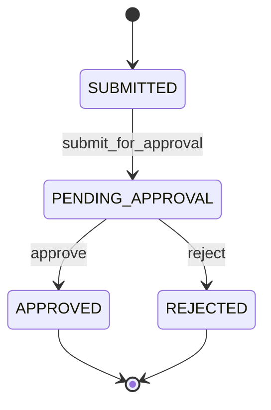

# Expense Workflow

```mermaid
stateDiagram-v2
    [*] --> SUBMITTED
    PENDING_APPROVAL --> APPROVED : approve
    PENDING_APPROVAL --> REJECTED : reject
    SUBMITTED --> PENDING_APPROVAL : submit_for_approval
    APPROVED --> [*]
    REJECTED --> [*]
```
