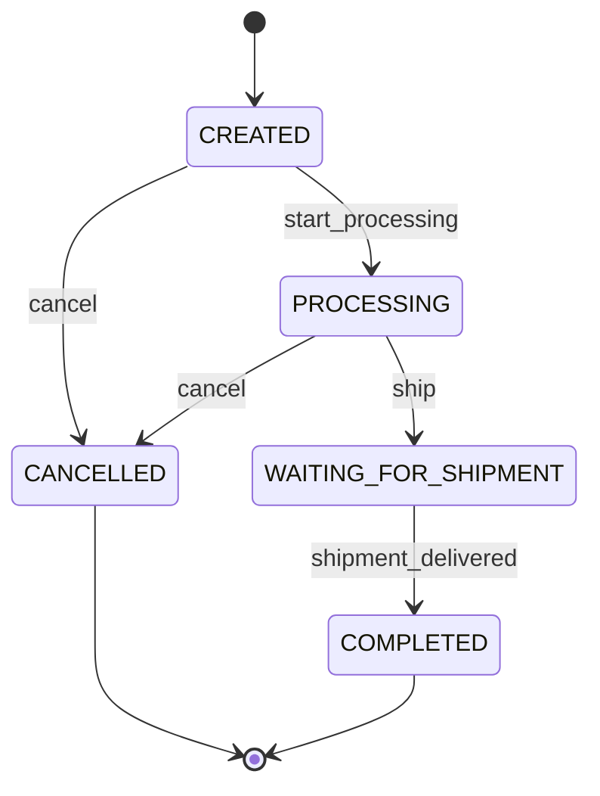
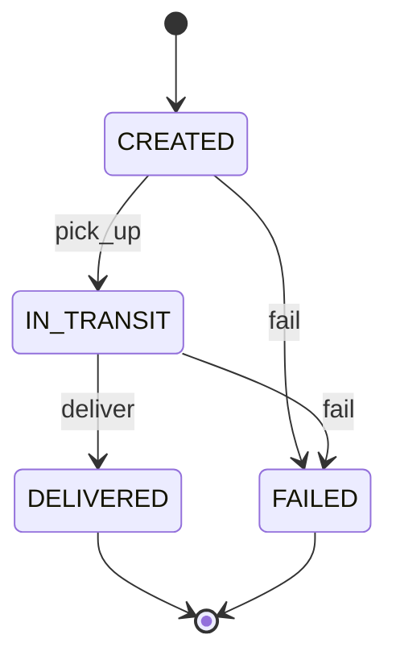

# Order Workflow

```mermaid
stateDiagram-v2
    [*] --> CREATED
    CREATED --> CANCELLED : cancel
    PROCESSING --> CANCELLED : cancel
    PROCESSING --> WAITING_FOR_SHIPMENT : ship
    WAITING_FOR_SHIPMENT --> COMPLETED : shipment_delivered
    CREATED --> PROCESSING : start_processing
    CANCELLED --> [*]
    COMPLETED --> [*]
```

# Shipment Workflow

```mermaid
stateDiagram-v2
    [*] --> CREATED
    IN_TRANSIT --> DELIVERED : deliver
    CREATED --> FAILED : fail
    IN_TRANSIT --> FAILED : fail
    CREATED --> IN_TRANSIT : pick_up
    DELIVERED --> [*]
    FAILED --> [*]
```
