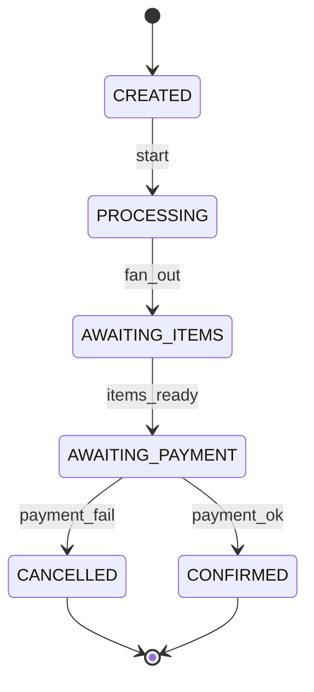
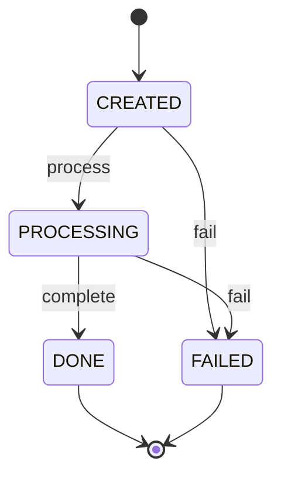

# Purchase Order Workflow

```mermaid
stateDiagram-v2
    [*] --> CREATED
    PROCESSING --> AWAITING_ITEMS : fan_out
    AWAITING_ITEMS --> AWAITING_PAYMENT : items_ready
    AWAITING_PAYMENT --> CANCELLED : payment_fail
    AWAITING_PAYMENT --> CONFIRMED : payment_ok
    CREATED --> PROCESSING : start
    CANCELLED --> [*]
    CONFIRMED --> [*]
```

# Item Workflow

```mermaid
stateDiagram-v2
    [*] --> CREATED
    PROCESSING --> DONE : complete
    CREATED --> FAILED : fail
    PROCESSING --> FAILED : fail
    CREATED --> PROCESSING : process
    DONE --> [*]
    FAILED --> [*]
```
